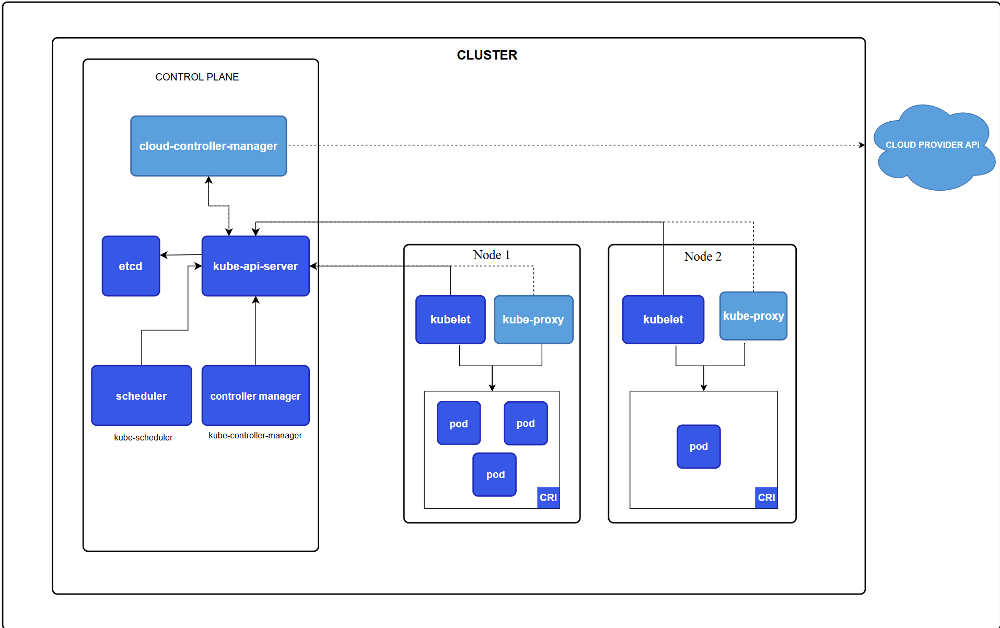
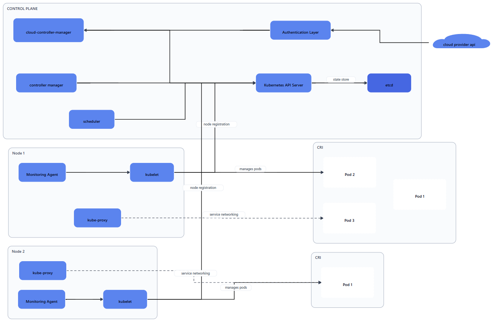
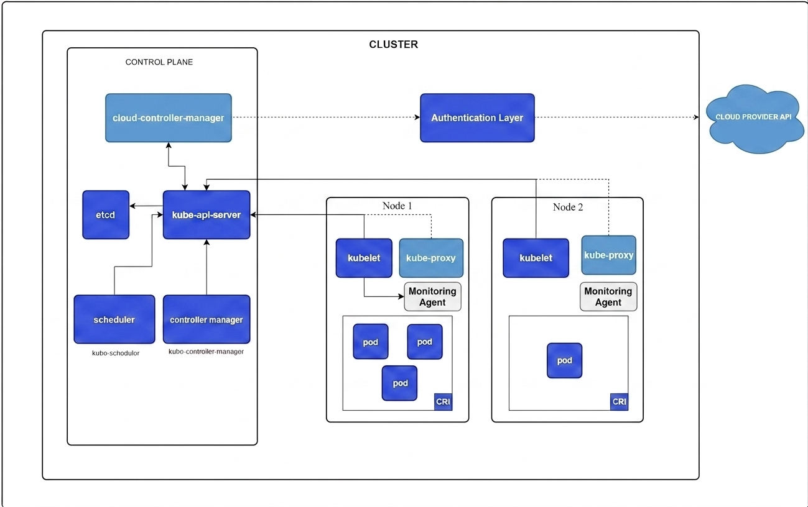
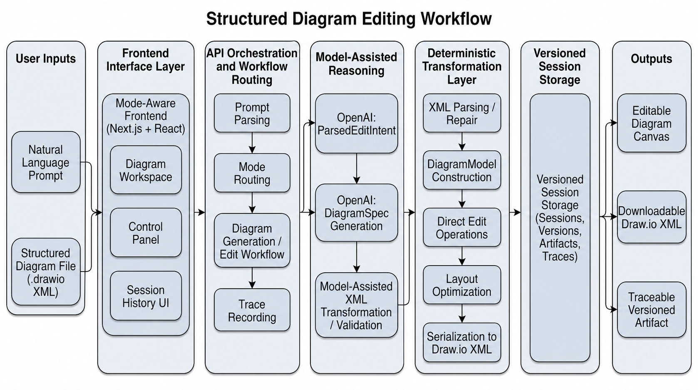
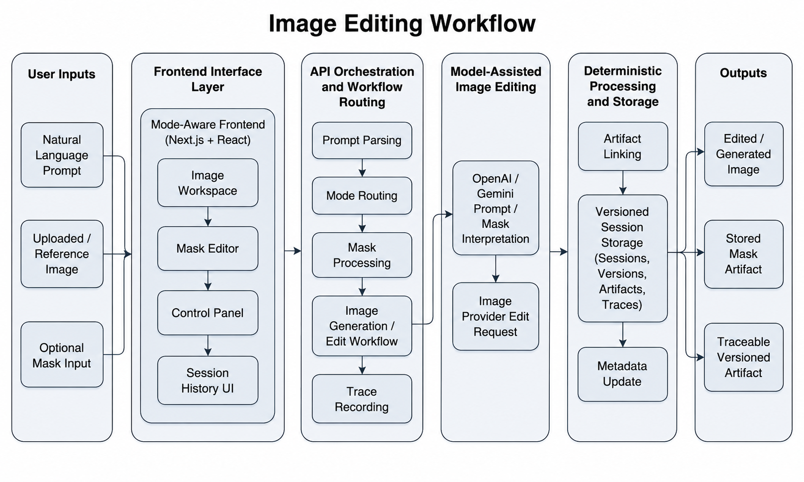

# SAGE

SAGE is a session-aware diagram and image editing prototype built around OpenAI reasoning and generation workflows. It supports importing Draw.io/diagrams.net XML, Mermaid source, and raster reference images; generating structured diagrams from prompts; reconstructing editable diagrams from screenshots; prompt-guided and direct interactive diagram edits; image generation and editing; localized mask edits; artifact downloads; trace inspection; version history; and metadata-layer revert.

The implementation follows `masterspec.md` as the source of truth. OpenAI is the reasoning, validation, and XML authority. Google Gemini can optionally be selected for image generation, diagram visual drafts, and mask-guided image editing; there is no ComfyUI or local non-API model workflow.

## Tech Stack

- Next.js App Router, React, TypeScript, Tailwind CSS
- Zustand for client editing/session state
- TanStack Query for frontend API orchestration
- Prisma with SQLite by default
- Draw.io / diagrams.net XML, Mermaid, and reference-image import with repair, serialization, and structured `DiagramModel` conversion
- Local filesystem artifact storage abstraction
- OpenAI API wrappers for structured reasoning, XML repair/editing, image generation, and image editing
- Optional Google Gemini Nano Banana 2 support for generated images, diagram visual drafts, and mask-guided image edits
- Sharp-backed SVG-to-PNG raster snapshots for diagram verification when available
- Vitest for backend, workflow, XML, mask, and frontend request-shaping tests
- Docker and Docker Compose for reproducible local development and production-like runtime

## Architecture Overview

The system is organized as thin UI and API layers over reusable service modules.

- `app/api/*` — typed route handlers; validate inputs with Zod, then delegate to services.
- `lib/workflows/*` — multi-stage orchestration for diagram and image workflows.
- `lib/openai/*` — OpenAI client creation, model wrappers, trace-aware stage calls, response validation, and safe JSON parsing.
- `lib/xml/drawio.ts` — Draw.io-compatible XML import, validation, repair, and serialization.
- `lib/diagram/*` — deterministic structured edit helpers and direct-edit reducers.
- `lib/session/*` — session, version, history, revert, prompt metadata, and trace persistence.
- `lib/storage/*` — artifact persistence and filesystem storage.
- `features/*` — frontend domain modules for session state, diagram editing, and image editing.
- `types/core.ts` — shared strongly typed contracts used by backend, workflows, and UI.

Every meaningful operation is stored as a session version, optionally pointing to Draw.io XML, diagram models, image outputs, uploads, or masks. OpenAI and deterministic workflow stages are recorded as traces for report/debug use.

## Major Workflows

### Diagram Import

`POST /api/diagram/import` accepts Draw.io XML or Mermaid source. Mermaid source is normalized into a `DiagramSpec`, converted into a `DiagramModel`, serialized as Draw.io-compatible XML, and stored as a new session version.

`POST /api/diagram/import-image` accepts PNG, JPEG, and WebP reference images. OpenAI vision extracts an editable `DiagramSpec`, which is converted into a `DiagramModel` and stored as Draw.io-compatible XML. Visible text becomes editable labels, containers become groups, nodes become movable elements, and relationships become connectors.

Import/export preserves common geometry, raw `mxCell` attributes, group-relative coordinates, and imported edge waypoints.

### Diagram Generation

`POST /api/diagram/generate` runs staged generation: (1) OpenAI expands the prompt into a diagram-specific generation prompt; (2) an optional visual draft is produced (Gemini when configured); (3) OpenAI vision converts the draft into a `DiagramSpec`, or generates it from text directly if no draft provider is set; (4) deterministic helpers serialize the spec to Draw.io-compatible XML; (5) validation/repair runs before storage; (6) an optional Sharp-backed rasterization feeds a conservative OpenAI verification pass; (7) all artifacts, metadata, and traces are persisted.

### Prompt-Guided Diagram Editing

`POST /api/diagram/edit` runs explicit stages for intent parsing, target analysis, edit planning, XML transformation, XML validation/repair, model import, artifact persistence, and change summary generation.

### Direct Diagram Editing

`POST /api/diagram/direct-edit` accepts structured canvas operations, applies deterministic model updates, serializes to XML, and creates a new version. The canvas provides hierarchical, grid, and radial layout modes; orthogonal connector routing; fit-to-view; manual zoom; source inspection; XML export; and version-history undo/redo.

### Image Generation

`POST /api/image/generate` calls the selected image provider wrapper, stores the generated image artifact, creates a version, and records trace metadata. OpenAI is the default provider; Gemini Nano Banana 2 can be enabled through environment configuration.

### Image Editing and Masks

`POST /api/image/edit` supports uploaded or generated images with an optional mask. OpenAI receives the mask natively; Gemini receives source and mask as multimodal input. Mask/source metadata is linked into version history separately from user prompts.

Mask tooling includes paint/erase, brush size, opacity, undo/redo, clear, and mask export.

### Revert and History

`POST /api/session/:id/revert` moves the current-version pointer to a prior version without rewriting history. `GET /api/session/:id` returns the full version timeline, artifacts, prompt metadata, and workflow state. Browser storage persists editor state across refreshes.

## OpenAI Integration Points

OpenAI calls are isolated in `lib/openai/service.ts` and composed by workflow services. Current wrappers include:

- `parseEditIntent(prompt, mode)`
- `analyzeDiagramTargets(diagramModel, parsedIntent)`
- `planDiagramEdits(diagramModel, parsedIntent, targetAnalysis)`
- `inferAndExpandDiagramPrompt(prompt)`
- `generateDiagramSpec(prompt)`
- `generateDiagramSpecFromImage(image, prompt, context)`
- `generateDiagramXmlFromSpec(diagramSpec)`
- `transformDiagramXml(existingXml, editPlan)`
- `validateAndRepairDiagramXml(xml)`
- `verifyDiagramAgainstPrompt(renderedImage, prompt, diagramSpec, diagramType)`
- `generateImageFromPrompt(prompt)`
- `editImageWithPrompt(image, prompt, mask?)`
- `summarizeArtifactChanges(before, after, context)`

Structured outputs are parsed through safe JSON helpers and validated with Zod. Invalid responses fail fast and are traced. XML repair has deterministic fallback behavior for malformed Draw.io documents.

## Setup

### Docker Setup

Create your local environment file:

```bash
cp .env.example .env
```

Set `OPENAI_API_KEY` in `.env`. The Compose services override storage defaults so SQLite data lives in a Docker volume at `/app/data` and artifacts live in `/app/public/artifacts`.

Build and run the production-like container:

```bash
npm run docker:build
npm run docker:up
```

Or run the development container with the repo mounted for iterative work:

```bash
npm run docker:dev
```

Then open `http://localhost:3000`.

Docker persistence:

- `app_data` stores the SQLite database.
- `app_artifacts` stores uploaded/generated artifacts.
- `dev_node_modules` keeps container-installed dependencies separate from your host machine.

The container entrypoint runs `prisma generate` and `prisma migrate deploy` before starting Next.js.

### Local Node Setup

Install dependencies:

```bash
npm install
```

Create your local environment file:

```bash
cp .env.example .env
```

Set at least:

```bash
OPENAI_API_KEY="your-openai-api-key"
DATABASE_URL="file:./dev.db"
```

Optional model and storage settings are documented in `.env.example`.

To use Nano Banana 2 for image generation, diagram visual drafts, and mask-guided image edits, set the Google key and switch one or both provider settings:

```bash
GOOGLE_API_KEY="your-google-api-key"
GOOGLE_IMAGE_MODEL="gemini-3.1-flash-image-preview"
IMAGE_GENERATION_PROVIDER="gemini"
DIAGRAM_IMAGE_PROVIDER="gemini"
```

Leave `IMAGE_GENERATION_PROVIDER` and `DIAGRAM_IMAGE_PROVIDER` unset or set to `openai` when you want OpenAI-only workflows. Diagram generation automatically falls back to direct OpenAI structured generation if the Gemini visual-draft path is unavailable.

Sharp is installed as an application dependency. Diagram verification uses it to convert rendered SVG snapshots into PNG input for OpenAI vision checks when `DIAGRAM_VERIFICATION_ENABLED="true"`.

Generate the Prisma client and run migrations:

```bash
npm run prisma:generate
npm run prisma:migrate
```

Start the app:

```bash
npm run dev
```

Then open `http://localhost:3000`.

## Useful Commands

```bash
npm run typecheck
npm run lint
npm test
npm run validate
npm run build
npm run build:isolated
npm run docker:build
npm run docker:up
npm run docker:dev
npm run seed:demo
npm run prisma:studio
```

On Windows or when a dev server is already holding `.next`, use `npm run build:isolated`. The project config respects `NEXT_DIST_DIR` and `.next-build/` is ignored by git.

`npm run seed:demo` creates a local presentation session with a sample Draw.io diagram and SVG image artifact. It writes artifact bytes under `public/artifacts/`, which is intentionally git-ignored.

## API Surface

- `POST /api/session/create`
- `GET /api/session/:id`
- `POST /api/session/:id/revert`
- `POST /api/diagram/import`
- `POST /api/diagram/import-image`
- `POST /api/diagram/generate`
- `POST /api/diagram/edit`
- `POST /api/diagram/direct-edit`
- `POST /api/image/generate`
- `POST /api/image/edit`
- `POST /api/upload`
- `GET /api/health`
- `GET /api/artifact/:id`
- `GET /api/download/:id`
- `GET /api/traces/:sessionId`

## Testing Status

The test suite covers:

- OpenAI wrapper response validation and safe structured parsing
- trace creation
- Draw.io XML import, repair, and round-trip behavior
- Draw.io group-relative geometry and imported edge waypoint preservation
- deterministic diagram layout and connector routing
- Mermaid-to-structured-diagram import
- reference-image-to-editable-diagram workflow orchestration
- direct diagram edit operations
- backend route flows for session, diagram, image, upload, artifact, and traces
- image mask coordinate normalization
- mask brush settings and localized edit request metadata
- frontend image edit request shaping and prompt sanitization
- session history and revert metadata behavior

`npm run validate` runs lint, typecheck, tests, and an isolated build as one check. The live OpenAI smoke test is opt-in; set `LIVE_OPENAI_SMOKE=1` to run it.

## Report and Paper Artifacts

Artifacts from the ASE Tools-style paper. Larger versions of paper figures are included here for easier inspection.

### Demonstrated Workflow

**Reference input** — original Kubernetes cluster architecture diagram used as the reconstruction benchmark input:



**Diagram reconstruction output** — final structured diagram after the prompt-guided edit sequence:



**Image editing output** — final result after sequential semantic edits to the Kubernetes diagram:



### System Workflow Figures

**Structured diagram-editing workflow** — prompt input → model-assisted reasoning → deterministic transformation → versioned Draw.io XML output:



**Image-editing workflow** — prompt and mask input → model-assisted image editing → artifact linking → versioned image output:



### Additional Report Materials

Report-ready descriptions for the system architecture diagram, internal data-flow diagram, session history/versioning diagram, evaluation workflow figure, evaluation plan, limitations, and future work are in:

- `docs/report-artifacts.md`

Local fixtures for report screenshots and repeatable demos live in `public/samples/`:

- `basic.drawio`
- `demo-architecture.drawio`
- `demo-source-image.svg`
- `evaluation-fixtures.json`

Benchmark-oriented fixtures live in `benchmarks/fixtures/`:

- `benchmark-suite.json`
- `xml-compatibility.drawio`
- `recoverability-missing-root.xml`

## Known Limitations

- The canvas is intentionally lighter than diagrams.net — no custom shape libraries, plugin registries, or full keyboard command parity.
- Very exotic Draw.io features (plugin payloads, embedded libraries, advanced label geometries) may still require repair after round-trip.
- Mermaid import covers flowchart/graph, sequence, class, and state diagrams. Advanced directives and plugin-specific syntax are not supported.
- Gemini mask-guided editing uses multimodal source+mask input rather than native alpha-mask inpainting; OpenAI is the stricter option for pixel-protected edits.
- Diagram verification is conservative — it corrects labels and node types but does not reconstruct missing topology.
- The mask editor does not include semantic segmentation or AI-assisted region selection.
- Authentication, multi-user authorization, hosted object storage, and production observability are out of scope for this prototype.

## Future Work

- Introduce cloud artifact storage for deployment.
- Add authenticated multi-user sessions.
- Add automated benchmark runners for XML compatibility, edit quality, latency, and user-facing recoverability.
- Add advanced diagram-editor commands such as multi-select alignment, distribute, snap guides, full keyboard shortcut parity, custom shape libraries, and richer edge-routing constraints.
- Add semantic image-mask selection, object-aware inpainting previews, and stronger provider-specific protection checks for non-masked image regions.
- Add asynchronous job queues, cancellation, and progress streaming for long-running multi-model diagram generation and verification workflows.
